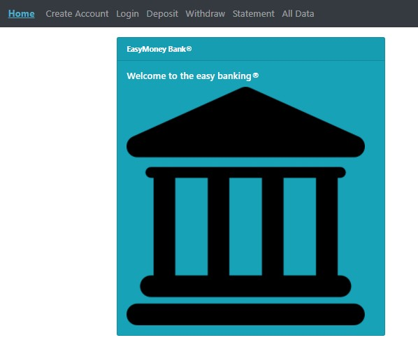

# Bank Exercise
>MIT Web Development in JavaScript as part of MIT xPRO Professional Certificate in Coding: Full Stack Development with MERN June 2021

## Title Description
This is an <em>exercise</em> to practice Front-End Development with React and ES6. It is intented to create a BANK APP to simulate deposits and withdrawls while learning how to control react components and its states.
Additions made to the original exercise:

### General Features:
- [x] created `Statement` component and children to list all entries to the account
- [x] created Account Statement card
- [x] withdrawals are `red colored` and followed by "D" for Debit
- [x] deposits are `blue colored` and followed by "C" for Credit
- [x] created css file and additional styling
- [x] emptying the input after submit
- [x] `Enter Key` on deposit and withdraw triggers action
- [x] removed Balance card, since this information will be inside Deposit, WithDraw and Statement
- [x] emptying the input after SUCCESSFUL submit of deposit and withdraw
- [x] emptying the input after SUCCESSFUL submit of Create Account and Login
- [x] deposits and withdrawls share a parent component that centralizes operation
- [x] prevent negative balance
- [x] refactor from standalone into create-react-app

### Login validations:
- [x] before any operation, user `MUST be logged` (with Create Account or Login)
- [x] creating an account fires an `automatic login`
- [x] added a `log off` button with conditional when user is already logged in
- [x] when not logged in, operation Cards will show `Please log in` instead of regular content (Deposit, Withdraw, Statement)
- [x] when user is logged in, the `Create Account` and `Login` will show the `Logoff` button only

### Data validations:
- [x] negative values are not Submitted and user receives an alert
- [x] zero values are not Submitted and user receives an alert
- [x] name validation now requires at least two word
- [x] email at Create Account requires format validation: email MUST contain @ and '.' (at least one dot in the domain side)
- [x] password must be at least 8 characters long
- [x] Create Account card uses a form
- [x] Create Account each field now gives its instant feedback on  requirements as user is typing
- [x] Create Account button will one become enabled if all field requirements are fulfilled
  
## How to Run
To try a live version of the new app version you may try this <a href="https://burlacenko.github.io/BankApp/bank_client/build/index.html">GitHub page</a> or right from <a href="http://daniel-burlacenkobankingapplication.s3-website.us-east-2.amazonaws.com/">AWS3 service</a>.

If you desire to try it locally, fork and clone the project, run `npm install` to have dependancies install and then start a server to access the <strong>index.html</strong> in the browser.

Also, I kept a live version of the old standalone version in <a href="https://burlacenko.github.io/Bank/index.html">here</a> if you wanna try.

Learn more on how to deploy your app and run it directly as a github page: https://www.c-sharpcorner.com/article/how-to-deploy-react-application-on-github-pages/

## Roadmap of future improvements
- [ ] splash/intro screen
- [ ] login needs to check if user already exists and load previously saved data
- [ ] create account needs to check if user already exists and deny new account
- [ ] if user is logged in, the `navbar` title should change from login to logout
- [ ] if user is logged in, the `card` title should change from login to logout
- [ ] include `date and time` for each line of the Account Statement
- [ ] more styling
 
  <table>
  <tr><td>Statement Color</td><td>Means</td></tr>
  <tr><td>Blue</td><td>Credits</td></tr>
  <tr><td>Red</td><td>Debits</td>
  </table>
  
## MIT License
Copyright (c) 2021 <em>Burlacenko</em>

This project has been modified based on the original exercise of <em>Abel Sanchez</em>
under MIT xPro Web Development as part of Full Stack Development with MERN June 2021

Permission is hereby granted, free of charge, to any person obtaining a copy
of this software and associated documentation files (the "Software"), to deal
in the Software without restriction, including without limitation the rights
to use, copy, modify, merge, publish, distribute, sublicense, and/or sell
copies of the Software, and to permit persons to whom the Software is
furnished to do so, subject to the following conditions:

The above copyright notice and this permission notice shall be included in all
copies or substantial portions of the Software.

THE SOFTWARE IS PROVIDED "AS IS", WITHOUT WARRANTY OF ANY KIND, EXPRESS OR
IMPLIED, INCLUDING BUT NOT LIMITED TO THE WARRANTIES OF MERCHANTABILITY,
FITNESS FOR A PARTICULAR PURPOSE AND NONINFRINGEMENT. IN NO EVENT SHALL THE
AUTHORS OR COPYRIGHT HOLDERS BE LIABLE FOR ANY CLAIM, DAMAGES OR OTHER
LIABILITY, WHETHER IN AN ACTION OF CONTRACT, TORT OR OTHERWISE, ARISING FROM,
OUT OF OR IN CONNECTION WITH THE SOFTWARE OR THE USE OR OTHER DEALINGS IN THE
SOFTWARE.
	
## Screenshot

