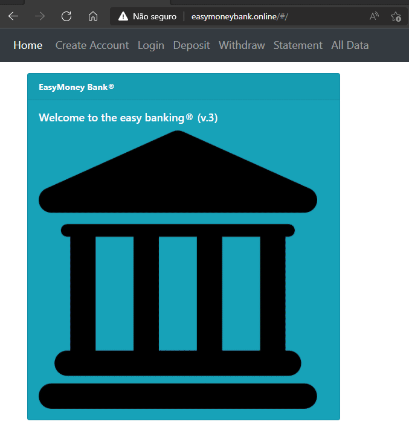

# EasyMoney Bank Online App
>MIT Web Development in JavaScript as part of MIT xPRO Professional Certificate in Coding: Full Stack Development with MERN June 2021

## Description
This is a project to practice a MERN FullStack Development with MongoDB, Express, React and Node. It is intented to create a BANK APP to simulate deposits and withdraws while learning how to control accounts, roles, authentication and authorization with react components and its states, a server in back-end and a database in the cloud.

## How to Run
A live version of the three tier application is fully operational at <a href="http://www.easymoneybank.online" target="_blank">EasyMoney Bank Online</a>.
There is still an old webpage version (without server/database) that is kept for record at <a href="http://daniel-burlacenkobankingapplication.s3-website.us-east-2.amazonaws.com/" target="_blank" >AWS3 service</a>.

### Installation Guidelines
Since the project is now a three tier application, if you desire to try it locally, firt fork and clone the project, run `npm install` at both foldes: server and bank_client to have dependancies installed, set a MongoDB instance at localhost:27017, start the server (npm start inside folder `server`) and then start the react app (npm start inside folder `bank_client`).

## Screenshot

## Technology used
The MERN stack is the base of this project: MongoDB, Express, React and Node.
MongoDB Atlas is in charge of the cloud database.

## Features
### General Features:
- [x] created `Statement` component and children to list all entries to the account
- [x] removed Balance card, since this information will be inside Deposit, WithDraw and Statement
- [x] created Account Statement card
- [x] created css file and additional styling
- [x] `Enter Key` on deposit and withdraw triggers action
- [x] deposits and withdrawls share a parent component that centralizes operation
- [x] emptying the inputs at Create Account after submit
- [x] emptying the input after SUCCESSFUL submit of deposit and withdraw
- [x] emptying the input after SUCCESSFUL submit of Create Account and Login
- [x] prevent negative balance
- [x] refactor from standalone into create-react-app
- [x] create a database in the cloud
- [x] create a server in the cloud
- [x] after successfull `Login` or `Create Account` user is redirected to Statement page
- [x] withdrawals are `red colored` and followed by "D" for Debit
- [x] deposits are `blue colored` and followed by "C" for Credit
 
  <table>
  <tr><td>Statement Color</td><td>Means</td></tr>
  <tr><td>Blue</td><td>Credits</td></tr>
  <tr><td>Red</td><td>Debits</td>
  </table>

### Login validations:
- [x] before any operation, user `MUST be logged` (with `Create Account` or `Login`)
- [x] creating an account fires an `automatic login`
- [x] added a `log off` button with conditional when user is already logged in
- [x] when not logged in, operation Cards will show `Please log in` instead of regular content (Deposit, Withdraw, Statement)
- [x] when user is logged in, the `Create Account` and `Login` will show the `Logoff` button only
- [x] login needs to check if user already exists and load previously saved data
- [x] `Create Account` needs to check if user already exists and it automatically logs in if email and password are valid
- [x] `Create Account` needs to check if user already exists and it denies new account if the provided password does NOT match

### Data validations:
- [x] negative values are not Submitted and user receives an alert
- [x] zero values are not Submitted and user receives an alert
- [x] name validation now requires at least two word
- [x] email at `Create Account` requires format validation: email MUST contain @ and '.' (at least one dot in the domain side)
- [x] password must be at least 8 characters long
- [x] `Create Account` card uses a formik form
- [x] `Create Account` each field now gives its instant feedback on  requirements as user is typing
- [x] `Create Account` button will only become enabled if all field requirements are fulfilled
  
## Roadmap of future improvements
- [ ] Authentication and Authorization for session controls with jwt or Firebase
- [ ] show account's holder name in the header or navbar
- [ ] inform user data/time of last login (before current login) in the header or navbar
- [ ] `Create Account` should confirm email by asking for a second input
- [ ] add a "history" field for each transaction to be shown in statements
- [ ] include `date and time` for each line of the Account Statement
- [ ] include `history` for each line of the Account Statement
- [ ] add tranfers from one account to another
- [ ] if user is logged in, the `navbar` title should change from login to logout
- [ ] if user is logged in, the `card` title should change from login to logout
- [ ] `Create Account` should begin with email and password only
- [ ] validate account creation by email link confirmation
- [ ] create a reset password link thru user email
- [ ] add more fields to user data form following email check
- [ ] add https to domain
- [ ] improve visual of alert messages
- [ ] splash/intro screen
- [ ] more styling
  
## MIT License
Copyright (c) 2021 <em>Burlacenko</em>

This project has been modified based on the original exercise of <em>Abel Sanchez</em>
under MIT xPro Web Development as part of Full Stack Development with MERN June 2021

Permission is hereby granted, free of charge, to any person obtaining a copy
of this software and associated documentation files (the "Software"), to deal
in the Software without restriction, including without limitation the rights
to use, copy, modify, merge, publish, distribute, sublicense, and/or sell
copies of the Software, and to permit persons to whom the Software is
furnished to do so, subject to the following conditions:

The above copyright notice and this permission notice shall be included in all
copies or substantial portions of the Software.

THE SOFTWARE IS PROVIDED "AS IS", WITHOUT WARRANTY OF ANY KIND, EXPRESS OR
IMPLIED, INCLUDING BUT NOT LIMITED TO THE WARRANTIES OF MERCHANTABILITY,
FITNESS FOR A PARTICULAR PURPOSE AND NONINFRINGEMENT. IN NO EVENT SHALL THE
AUTHORS OR COPYRIGHT HOLDERS BE LIABLE FOR ANY CLAIM, DAMAGES OR OTHER
LIABILITY, WHETHER IN AN ACTION OF CONTRACT, TORT OR OTHERWISE, ARISING FROM,
OUT OF OR IN CONNECTION WITH THE SOFTWARE OR THE USE OR OTHER DEALINGS IN THE
SOFTWARE.

## Versions
v.1 Single Page Application without data persistance 
v.2 Added user validation at Login and storage of bank transactions 
v.3 Added User Creation at database 
