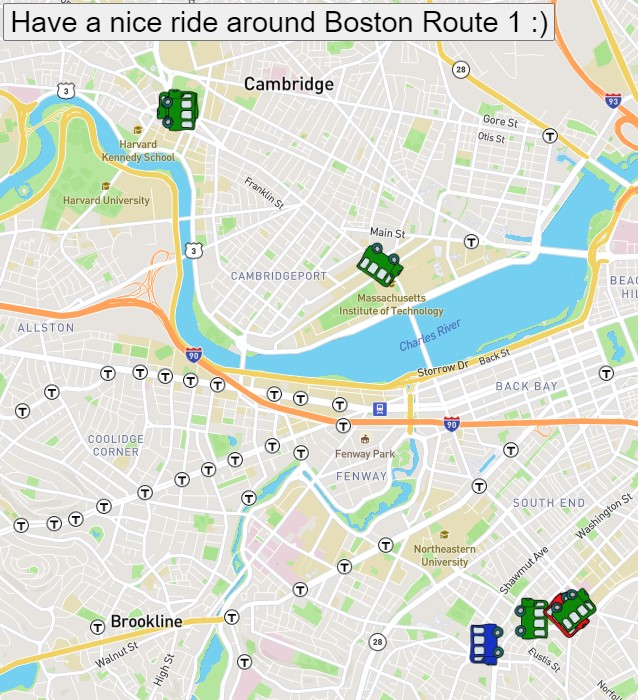

# Real Time Bus Tracker
>MIT Web Development in JavaScript as part of MIT xPRO Professional Certificate in Coding: Full Stack Development with MERN June 2021

## Title Description
This is an <em>exercise</em> to practice Web Development in JavaScript and it displays some city buses locations at Boston in real-time.
Additions made to the original exercise:

- [x] `marker` is plotted for all buses in service
- [x] `current address` is now identified from each bus coordinates (longitude and latitude)
- [x] `icon` changed from marker to a bus icon
- [x] `rotation` of the bus icon accordingly to its current direction
- [x] `popUp` was added to show information about that bus when a marker is clicked:
  * Line Number
  * Bearing
  * Current Stop Sequence
  * Current Address
- [x] `information` on each popUp will show the bus line, its current bearing, stop sequence and address
- [x] `occupancy status` is shown as a differente color of the bus icon:
  
  <table>
  <tr><td>Green</td><td>many seats available</td></tr>
  <tr><td>Red</td><td>few seats available</td>
  <tr><td>Blue</td><td>occupancy unknown</td></tr>
  </table>
  
## How to Run
To try a live version, click <a href="https://burlacenko.github.io/BusTrackerBoston/index.html">here</a>. To try it locally, fork and clone the project and then open <strong>index.html</strong> in the browser.

## Roadmap of future improvements:
- [ ] A button to toggle "show all" / "hide all" permanent ballons with each bus information</li>
- [ ] Select one bus to be followed (map will keep centering at selected bus)</li>
- [ ] Add a combo box to list all availble routes</li>
- [ ] Draw a line showing the full route</li>
- [ ] Show date time info</li>
  
## MIT License
Copyright (c) 2021 <em>Burlacenko</em>

This project has been modified based on the original exercise of <em>Abel Sanchez</em>
under MIT xPro Web Development as part of Full Stack Development with MERN June 2021

Permission is hereby granted, free of charge, to any person obtaining a copy
of this software and associated documentation files (the "Software"), to deal
in the Software without restriction, including without limitation the rights
to use, copy, modify, merge, publish, distribute, sublicense, and/or sell
copies of the Software, and to permit persons to whom the Software is
furnished to do so, subject to the following conditions:

The above copyright notice and this permission notice shall be included in all
copies or substantial portions of the Software.

THE SOFTWARE IS PROVIDED "AS IS", WITHOUT WARRANTY OF ANY KIND, EXPRESS OR
IMPLIED, INCLUDING BUT NOT LIMITED TO THE WARRANTIES OF MERCHANTABILITY,
FITNESS FOR A PARTICULAR PURPOSE AND NONINFRINGEMENT. IN NO EVENT SHALL THE
AUTHORS OR COPYRIGHT HOLDERS BE LIABLE FOR ANY CLAIM, DAMAGES OR OTHER
LIABILITY, WHETHER IN AN ACTION OF CONTRACT, TORT OR OTHERWISE, ARISING FROM,
OUT OF OR IN CONNECTION WITH THE SOFTWARE OR THE USE OR OTHER DEALINGS IN THE
SOFTWARE.
	
## Screenshot

