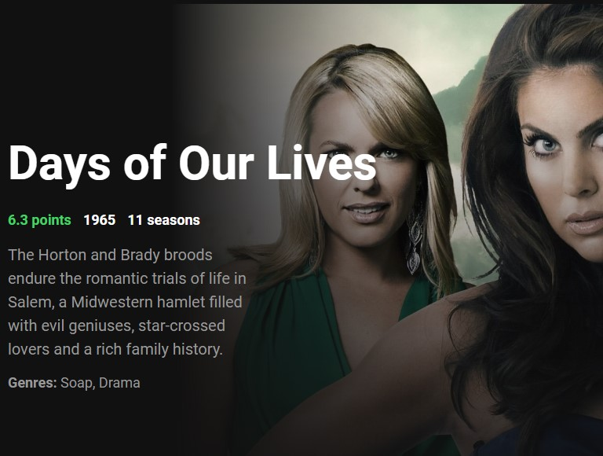

# Featured Videos React Exercise
>MIT Web Development in JavaScript as part of MIT xPRO Professional Certificate in Coding: Full Stack Development with MERN June 2021

## Title Description
This is a coding <em>challenge</em> to practice Front-End Development with React and ES6 for data fetching. It is intented to create a simple React app to fetch, manipulate and render data. For this purpose, I chose the themoviedb.org API, which provides information on movies and series among other stuff.

## How to Run
To try a live version, click <a href="https://burlacenko.github.io/FeaturedVideos/index.html">here</a>. To try it locally, fork and clone the project and then open <strong>index.html</strong> in the browser.

## Features
Project was created from scratch with these original features:

- [x] random data is fetched from the API
- [x] when page is reloaded, fetching and rendering new images and facts
  
## Roadmap of future improvements
- [ ] auto reload to make it like a "slide show"
- [ ] allow users to pause the "slide show"
- [ ] allow users to make it slower or faster
  
## MIT License
Copyright (c) 2021 <em>Burlacenko</em>

This project has been modified based on the original exercise of <em>Abel Sanchez</em>
under MIT xPro Web Development as part of Full Stack Development with MERN June 2021

Permission is hereby granted, free of charge, to any person obtaining a copy
of this software and associated documentation files (the "Software"), to deal
in the Software without restriction, including without limitation the rights
to use, copy, modify, merge, publish, distribute, sublicense, and/or sell
copies of the Software, and to permit persons to whom the Software is
furnished to do so, subject to the following conditions:

The above copyright notice and this permission notice shall be included in all
copies or substantial portions of the Software.

THE SOFTWARE IS PROVIDED "AS IS", WITHOUT WARRANTY OF ANY KIND, EXPRESS OR
IMPLIED, INCLUDING BUT NOT LIMITED TO THE WARRANTIES OF MERCHANTABILITY,
FITNESS FOR A PARTICULAR PURPOSE AND NONINFRINGEMENT. IN NO EVENT SHALL THE
AUTHORS OR COPYRIGHT HOLDERS BE LIABLE FOR ANY CLAIM, DAMAGES OR OTHER
LIABILITY, WHETHER IN AN ACTION OF CONTRACT, TORT OR OTHERWISE, ARISING FROM,
OUT OF OR IN CONNECTION WITH THE SOFTWARE OR THE USE OR OTHER DEALINGS IN THE
SOFTWARE.
	
## Screenshot

