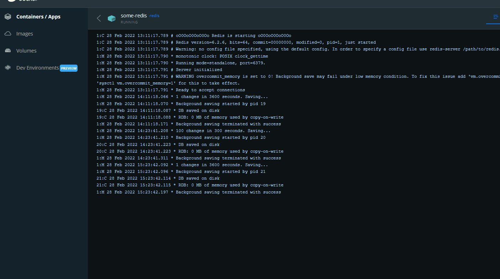

# Fullstack Holy Grail with Redis-Docker
>MIT Web Development in JavaScript as part of MIT xPRO Professional Certificate in Coding: Full Stack Development with MERN June 2021

## Title Description
This is an <em>exercise</em> to show a small Full Stack project with:
- `Back-End` server with Express serving static files
- `Front-End` Holy Grail page built on a react app
- `Database` with Redis running in a Docker container

### General Features:
- [x] Express server at localhost 3005 serving static files of the Holy Grail
- [x] Holy Grail web page is divided in 5 sections: header, footer, left, right and article
- [x] Each section of the Holly Grail is a react component and they all react to changes in the values saved in the database
- [x] Redis on a Docker container holds the data for each Holy Grail section name/value pair

## View project running
An animation of the project running is available at the end of this page

## How to Run
If you desire to try it locally:
- run `npm install` to have dependancies installed
- start a redis instance with "docker run -p 6379:6379 --name some-redis -d redis"
- start the server with "npm start"
- access the <strong>app</strong> in the browser at default "http://localhost:3005"
  
## MIT License
Copyright (c) 2021 <em>Burlacenko</em>

This project has been built and modified based on the original exercise of <em>Dr. Abel Sanchez</em>
under MIT xPro as part of Full Stack Development with MERN June 2021

Permission is hereby granted, free of charge, to any person obtaining a copy
of this software and associated documentation files (the "Software"), to deal
in the Software without restriction, including without limitation the rights
to use, copy, modify, merge, publish, distribute, sublicense, and/or sell
copies of the Software, and to permit persons to whom the Software is
furnished to do so, subject to the following conditions:

The above copyright notice and this permission notice shall be included in all
copies or substantial portions of the Software.

THE SOFTWARE IS PROVIDED "AS IS", WITHOUT WARRANTY OF ANY KIND, EXPRESS OR
IMPLIED, INCLUDING BUT NOT LIMITED TO THE WARRANTIES OF MERCHANTABILITY,
FITNESS FOR A PARTICULAR PURPOSE AND NONINFRINGEMENT. IN NO EVENT SHALL THE
AUTHORS OR COPYRIGHT HOLDERS BE LIABLE FOR ANY CLAIM, DAMAGES OR OTHER
LIABILITY, WHETHER IN AN ACTION OF CONTRACT, TORT OR OTHERWISE, ARISING FROM,
OUT OF OR IN CONNECTION WITH THE SOFTWARE OR THE USE OR OTHER DEALINGS IN THE
SOFTWARE.
	
## Animation

