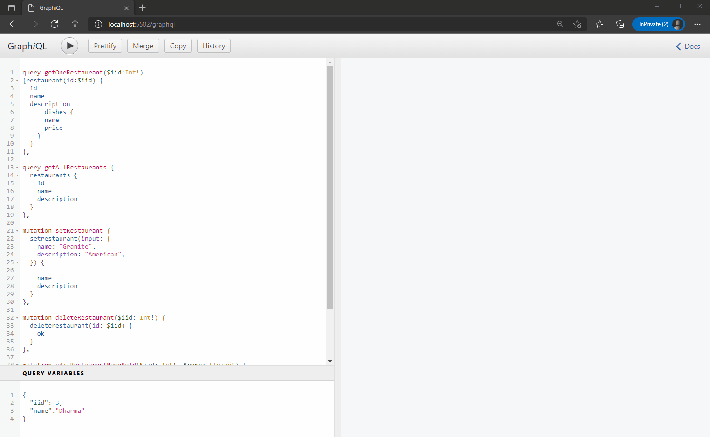
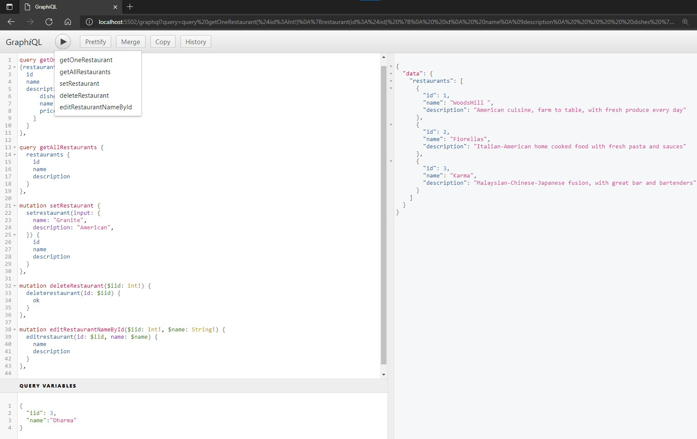

# Restaurant Exercise
>MIT Web Development in JavaScript as part of MIT xPRO Professional Certificate in Coding: Full Stack Development with MERN June 2021

## Title Description
This is an <em>exercise</em> to practice Back-End Development. It is intented to create RESTAURANT DATA to test GraphQL queries and mutation.
Additions made to the original exercise:

### General Features:
- [x] added code for the basic method "restaurant" (getOneRestaurant)
- [x] added code for the basic method "restaurants" (getAllRestaurants)
- [x] added code for the basic method "setrestaurant" (setRestaurant)
- [x] added code for the basic method "deleterestaurant" (deleteRestaurant)
- [x] added code for the basic method "editrestaurant" (editRestaurantNameById)
  
## How to Run
If you desire to try it locally, fork and clone the project, run `npm install` to have dependancies installed and then start server with `npm start` or `npm run dev` and open browser at http://localhost:5502/graphql.

## Roadmap of future improvements
- [ ] a web page
- [ ] splash/intro screen
- [ ] login needs to check if user already exists and load previously saved data
- [ ] create account needs to check if user already exists and deny new account
- [ ] more styling
 
## MIT License
Copyright (c) 2021 <em>Burlacenko</em>

This project has been modified based on the original exercise of <em>John Williams</em>
under MIT xPro Web Development as part of Full Stack Development with MERN June 2021

Permission is hereby granted, free of charge, to any person obtaining a copy
of this software and associated documentation files (the "Software"), to deal
in the Software without restriction, including without limitation the rights
to use, copy, modify, merge, publish, distribute, sublicense, and/or sell
copies of the Software, and to permit persons to whom the Software is
furnished to do so, subject to the following conditions:

The above copyright notice and this permission notice shall be included in all
copies or substantial portions of the Software.

THE SOFTWARE IS PROVIDED "AS IS", WITHOUT WARRANTY OF ANY KIND, EXPRESS OR
IMPLIED, INCLUDING BUT NOT LIMITED TO THE WARRANTIES OF MERCHANTABILITY,
FITNESS FOR A PARTICULAR PURPOSE AND NONINFRINGEMENT. IN NO EVENT SHALL THE
AUTHORS OR COPYRIGHT HOLDERS BE LIABLE FOR ANY CLAIM, DAMAGES OR OTHER
LIABILITY, WHETHER IN AN ACTION OF CONTRACT, TORT OR OTHERWISE, ARISING FROM,
OUT OF OR IN CONNECTION WITH THE SOFTWARE OR THE USE OR OTHER DEALINGS IN THE
SOFTWARE.
	
## Screenshot

