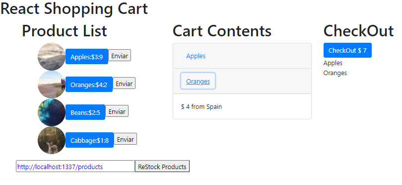

# Shopping Cart W19 React Exercise
>MIT Web Development in JavaScript as part of MIT xPRO Professional Certificate in Coding: Full Stack Development with MERN June 2021

## Title Description
This is a coding <em>exercise</em> to practice Front-End Development with React and ES6 for strapi data fetching. It is intented to create a simple React app to fetch, manipulate and render data from a localhost strapi DB.

## How to Run
To try a live version, click <a href="https://burlacenko.github.io/ShoppingCart-w19/shop/index.html">here</a>. To try it locally, fork and clone the project and then open <strong>index.html</strong> in the browser.

## Features
Project was with these original features:
- [x] random photo data is fetched from the picsum API
- [x] feature `delete` item from Cart Content
- [x] `CheckOut` sums up all items in the `Cart Content`

## Improvements:
- [x]  to `subtract items from stock` when there are moved to the shoppping cart
- [x]  to `add items back to Product List` when deleted from Cart Content
- [x]  to restock items `retrieving data from local strapi` database
- [x]  control restocking process to add items to existing product in the list instead of simply adding new items in the products' list

## Roadmap of future improvements
- [ ] search for pictures of the actual items
- [ ] add a `delete` button for each item in Cart Content
- [ ] design and styling
  
## MIT License
Copyright (c) 2021 <em>Burlacenko</em>

Permission is hereby granted, free of charge, to any person obtaining a copy
of this software and associated documentation files (the "Software"), to deal
in the Software without restriction, including without limitation the rights
to use, copy, modify, merge, publish, distribute, sublicense, and/or sell
copies of the Software, and to permit persons to whom the Software is
furnished to do so, subject to the following conditions:

The above copyright notice and this permission notice shall be included in all
copies or substantial portions of the Software.

THE SOFTWARE IS PROVIDED "AS IS", WITHOUT WARRANTY OF ANY KIND, EXPRESS OR
IMPLIED, INCLUDING BUT NOT LIMITED TO THE WARRANTIES OF MERCHANTABILITY,
FITNESS FOR A PARTICULAR PURPOSE AND NONINFRINGEMENT. IN NO EVENT SHALL THE
AUTHORS OR COPYRIGHT HOLDERS BE LIABLE FOR ANY CLAIM, DAMAGES OR OTHER
LIABILITY, WHETHER IN AN ACTION OF CONTRACT, TORT OR OTHERWISE, ARISING FROM,
OUT OF OR IN CONNECTION WITH THE SOFTWARE OR THE USE OR OTHER DEALINGS IN THE
SOFTWARE.
	
## Screenshot

