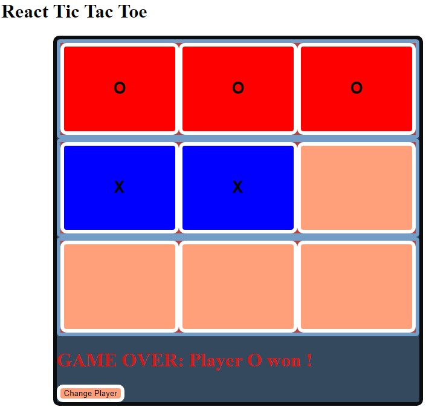

# Tic Tac Toe Exercise
>MIT Web Development in React as part of MIT xPRO Professional Certificate in Coding: Full Stack Development with MERN June 2021

## Title Description
This is an <em>exercise</em> to practice Front-End Development with React and ES6. It is intented to create a simple TIC TAC TOE game.
Additions made to the original exercise:

- [x] user cannot select a `square already taken`
- [x] each player has its own `specific color`
- [x] new `styling` of the board
- [x] a `game over` alert is shown if user tries to continue the game after its final
  
## How to Run
To try a live version, click <a href="https://burlacenko.github.io/TicTacToe/index.html">here</a>. To try it locally, fork and clone the project and then open <strong>index.html</strong> in the browser.

## Roadmap of future improvements
- [ ] Add `tie` message
- [ ] Improve styles with css
 
## MIT License
Copyright (c) 2021 <em>Burlacenko</em>

This project has been modified based on the original exercise of <em>John Williams</em>
under MIT xPro Web Development as part of Full Stack Development with MERN June 2021

Permission is hereby granted, free of charge, to any person obtaining a copy
of this software and associated documentation files (the "Software"), to deal
in the Software without restriction, including without limitation the rights
to use, copy, modify, merge, publish, distribute, sublicense, and/or sell
copies of the Software, and to permit persons to whom the Software is
furnished to do so, subject to the following conditions:

The above copyright notice and this permission notice shall be included in all
copies or substantial portions of the Software.

THE SOFTWARE IS PROVIDED "AS IS", WITHOUT WARRANTY OF ANY KIND, EXPRESS OR
IMPLIED, INCLUDING BUT NOT LIMITED TO THE WARRANTIES OF MERCHANTABILITY,
FITNESS FOR A PARTICULAR PURPOSE AND NONINFRINGEMENT. IN NO EVENT SHALL THE
AUTHORS OR COPYRIGHT HOLDERS BE LIABLE FOR ANY CLAIM, DAMAGES OR OTHER
LIABILITY, WHETHER IN AN ACTION OF CONTRACT, TORT OR OTHERWISE, ARISING FROM,
OUT OF OR IN CONNECTION WITH THE SOFTWARE OR THE USE OR OTHER DEALINGS IN THE
SOFTWARE.
	
## Screenshot

